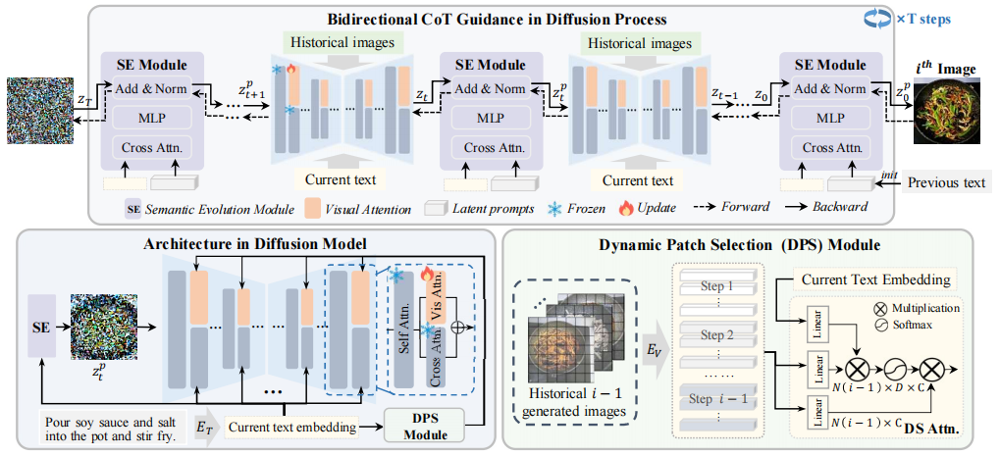

<!-- # magic-edit.github.io -->

  <h2 align="center">[ACM MM 2025] Chain-of-Cooking: Cooking Process Visualization via Bidirectional Chain-of-Thought Guidance</h2>
  

    <a href="https://scholar.google.com.hk/citations?user=8Iw1MyUAAAAJ&hl=zh-CN"><strong>Mengling Xu, </strong></a>
    <a href="https://scholar.google.com/citations?user=5GlOlNUAAAAJ"><strong>Ming Tao, </strong></a>
    <a href="https://scholar.google.com/citations?user=lDppvmoAAAAJ&hl=en"><strong>Bing-Kun Bao*, </strong></a>
  

## 📚 Introduction

   

This is an official Pytorch implementation for our paper "[Chain-of-Cooking: Cooking Process Visualization via Bidirectional Chain-of-Thought Guidance](https://arxiv.org/abs/2507.21529)". The code will coming soon. Thank you for your attention!

## 📚 Dataset
The proposed CookViz dataset: [download](https://drive.google.com/file/d/1uWmt4dnxGiAYlqkMtzqdbCZZamVEgrai/view?usp=drive_link)

### 📝 Citing

